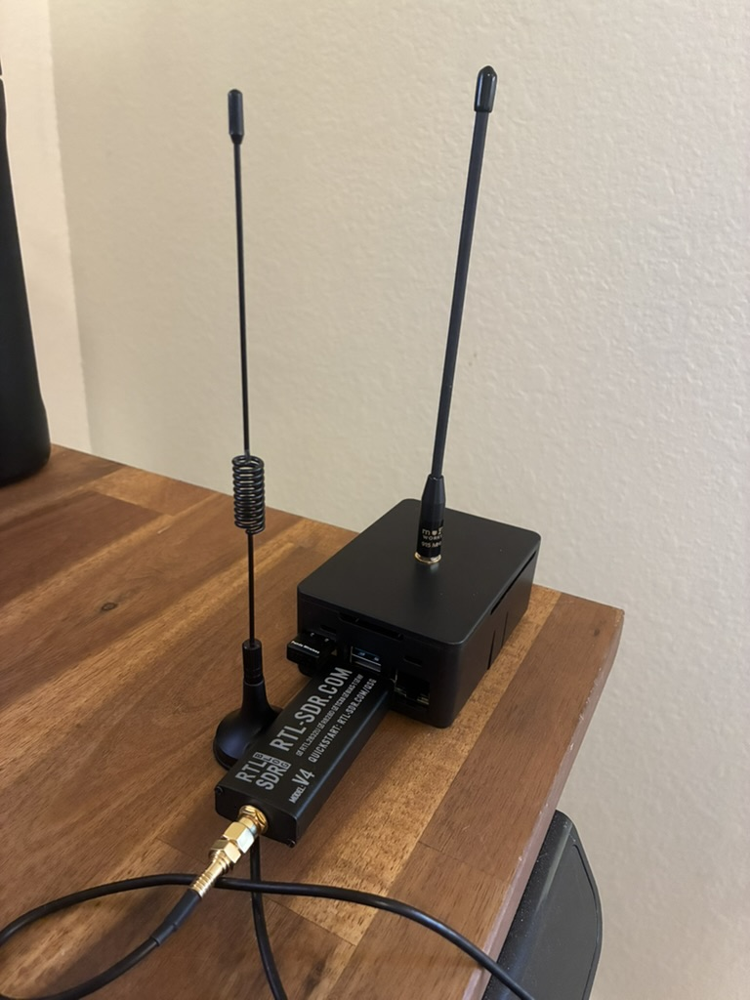

# ADS-B to CoT

Display Aircraft in TAK — ADS-B feed to TAK Gateway.

ADSBCOT is bundled directly into the OpenMANET image, preconfigured with sensible defaults so you can forward aircraft tracks into the Team Awareness Kit (TAK) ecosystem with minimal effort. The integration is intentionally opinionated: it assumes an RTL-SDR–based receiver and multicasts the resulting Cursor on Target (CoT) data across the mesh for TAK clients to consume.

For deeper details, refer to the [official ADSBCOT documentation](https://github.com/snstac/adsbcot).

---

## Features

- Converts ADS-B messages to CoT format for TAK clients.
- Preserves aircraft track, course, speed vectors, and metadata.
- Compatible with ATAK, TAKX, WinTAK, and iTAK.
- Supports multiple ADS-B data aggregators and COTS receivers.
- Accepts over-the-air RF ADS-B via SDR hardware.
- Runs on Python 3.7+ across Windows and Linux (already packaged for OpenMANET).

---

## Getting Started on OpenMANET

1. **Connect the SDR**  
   Plug an RTL-SDR dongle into your Raspberry Pi (USB 3 preferred). This satisfies the default ADSBCOT configuration baked into the image.

2. **Enable the services**  
   ADSB to CoT relies on two OpenWrt services:
   - `dump1090` (collects raw ADS-B frames from the SDR)  
   - `adsbtocot` (translates the feed into CoT and multicasts it)

   Enable them via the OpenWrt GUI (System → Startup) or through the CLI:

   ```bash
   /etc/init.d/dump1090 enable && /etc/init.d/dump1090 start
   /etc/init.d/adsbtocot enable && /etc/init.d/adsbtocot start
   ```

3. **Verify multicast delivery**  
   Check on a device running ATAK if the COTS messages are flowing.

That’s it, once the SDR is connected and the services are running, aircraft will appear in ATAK/WinTAK just like any other TAK marker.



---
