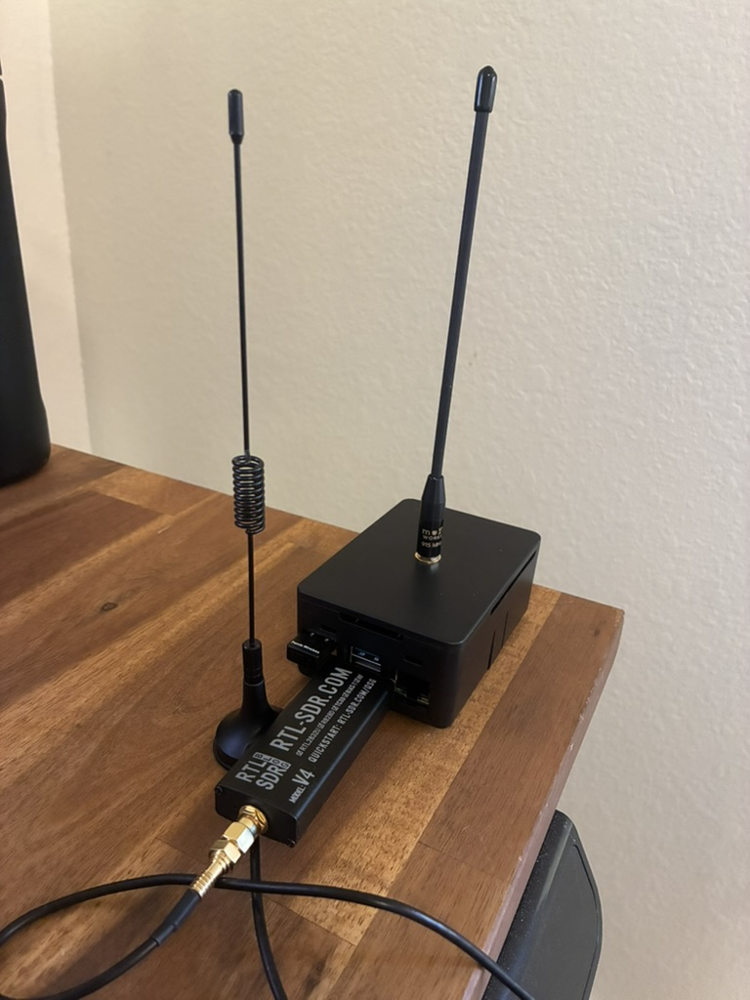

# ADS-B to CoT

Display Aircraft in TAK — ADS-B feed to TAK Gateway.

ADSBCOT is available for OpenMANET via `opkg`, but it is not installed by default. Once installed and enabled, you can forward aircraft tracks into the Team Awareness Kit (TAK) ecosystem with minimal effort. The integration is intentionally opinionated: it assumes an RTL-SDR–based receiver and multicasts the resulting Cursor on Target (CoT) data across the mesh for TAK clients to consume.

For deeper details, refer to the [official ADSBCOT documentation](https://github.com/snstac/adsbcot).

---

## Features

- Converts ADS-B messages to CoT format for TAK clients.
- Preserves aircraft track, course, speed vectors, and metadata.
- Compatible with ATAK, TAKX, WinTAK, and iTAK.
- Supports multiple ADS-B data aggregators and COTS receivers.
- Accepts over-the-air RF ADS-B via SDR hardware.
- Runs on Python 3.7+ across Windows and Linux.

---

## Getting Started on OpenMANET

1. **Install ADSBCOT**
   Install via LuCI (System -> Software -> Update lists -> search `adsbtocot` -> Install) or CLI:

   ```bash
   opkg update
   opkg install adsbtocot
   ```

   If using an older `adsbtocot` package revision that does not pull crypto dependencies automatically:

   ```bash
   opkg install python3-cryptography
   ```

2. **Connect the SDR**
   Plug an RTL-SDR dongle into your Raspberry Pi (USB 3 preferred).

3. **Enable and start services**
   ADS-B to CoT relies on two OpenWrt services:
   - `dump1090` (collects ADS-B frames from SDR)
   - `adsbcot` (converts ADS-B feed to CoT)

   Enable via OpenWrt GUI (System -> Startup) or CLI:

   ```bash
   /etc/init.d/dump1090 enable
   /etc/init.d/dump1090 start
   /etc/init.d/adsbcot enable
   /etc/init.d/adsbcot start
   ```

4. **Verify service state**

   ```bash
   which adsbcot
   pgrep -af "adsbcot|dump1090"
   logread -e adsbcot | tail -n 40
   ```

5. **Confirm in TAK**
   Open ATAK/WinTAK/iTAK and verify aircraft CoT markers are appearing.




---
