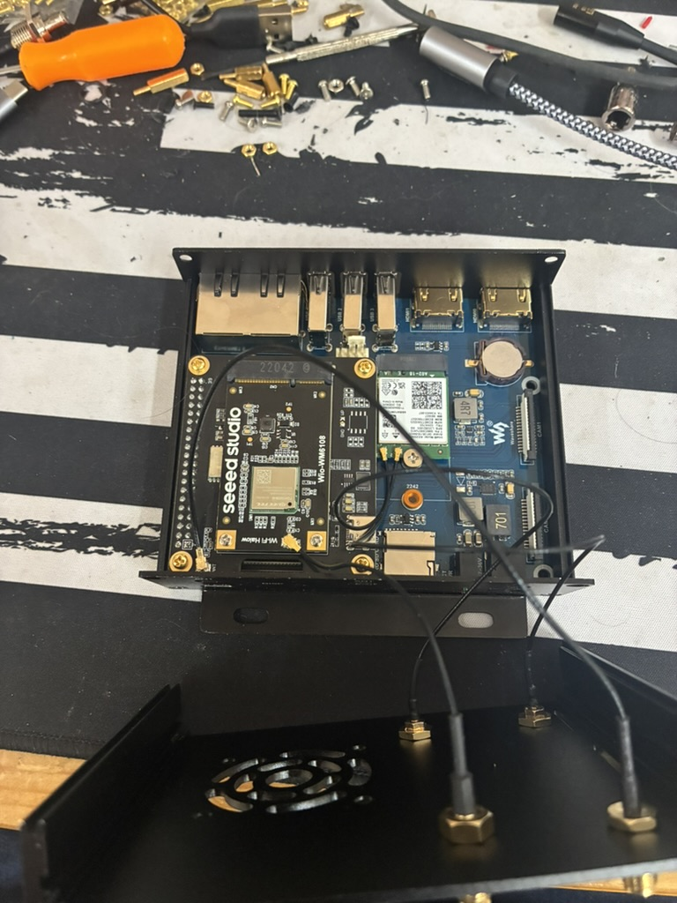

# Hardware

This page lists the recommended parts and supported boards for building an OpenMANET node. The project is designed for Raspberry Pi–based devices running OpenWrt, using Wi-Fi HaLow boards from Morse Micro.

---

## Recommended Parts List

| Item | Link | Optional |
|------|------|----------|
| Wio WM6180 Wi-Fi HaLow mini PCIe Module | [Seeed WM6180 Module](https://www.seeedstudio.com/Wio-WM6180-Wi-Fi-HaLow-mini-PCIe-Module-p-6394.html) | No |
| WM1302 Pi Hat | [Seeed WM1302 Pi Hat](https://www.seeedstudio.com/WM1302-Pi-Hat-p-4897.html) | No |
| External Antenna 868/915 MHz 2 dBi SMA Foldable | [Seeed 2 dBi Antenna](https://www.seeedstudio.com/External-Antenna-868-915MHZ-2dBi-SMA-L195mm-Foldable-p-5863.html) | No |
| UF.L to SMA-K 1.13 mm Cable (120 mm) | [Seeed UF.L Cable](https://www.seeedstudio.com/UF-L-SMA-K-1-13-120mm-p-5046.html) | No |
| Raspberry Pi 4 Model B (1 GB or greater) | [Seeed Pi 4 Model B](https://www.seeedstudio.com/Raspberry-Pi-4-Computer-Model-B-1GB-p-4078.html) | No |
| 21700 Rechargeable Batteries | [Amazon 21700 Cells](https://www.amazon.com/dp/B0D3GX96H6?ref_=ppx_hzsearch_conn_dt_b_fed_asin_title_4) | Yes |
| WaveShare UPS B (18650 version) | [Amazon WaveShare UPS B](https://www.amazon.com/gp/product/B0D39VDMDP/ref=ox_sc_saved_title_1?smid=A3B0XDFTVR980O&psc=1) | Yes |
| Panda PAU06 USB Wi-Fi Adapter | [Amazon PAU06](https://www.amazon.com/dp/B00762YNMG?ref_=ppx_hzsearch_conn_dt_b_fed_asin_title_1) | Yes |
| USB GPS Receiver (u-blox based) | [Amazon GPS Receiver](https://www.amazon.com/dp/B01MTU9KTF?ref_=ppx_hzsearch_conn_dt_b_fed_asin_title_1) | Yes |

---

## Board Interface Types: SDIO vs SPI

HaLow modules connect to the Raspberry Pi through different interfaces depending on the board design:

| Interface | Description | Supported on |
|------------|-------------|--------------|
| SDIO | High-speed 4-bit data bus. Native interface for most Pi models (e.g., Pi 3B+, Pi 2W). Offers better throughput and lower latency. | Raspberry Pi 3B+, Pi 2W, CM4 |
| SPI | Serial Peripheral Interface used by Seeed’s WM6180 mini-PCIe HAT. Easier to wire but slower than SDIO. | Raspberry Pi 4 only (currently supported) |

Notes:  
- The Seeed WM6180 board uses SPI, which is not yet supported on Pi 3B+ and Pi 2W.  
- SDIO HaLow boards are the only option for Pi 3B+ and Pi 2W at this time.  
- Separate firmware images will be available for SDIO-based Pi models.

---

## Optional / Advanced Parts

### Compute Module 4 (CM4) Builds

Most Raspberry Pi Compute Module 4 (CM4) carrier boards work with the OpenMANET image.  
A good option is the [WaveShare CM4 Dual ETH WiFi6 Base](https://www.waveshare.com/cm4-dual-eth-wifi6-base.htm), which includes:

- Two Ethernet ports for bridging or mesh uplink  
- An M.2 slot for a standard Wi-Fi card (AX200 or AX210)  
- Full GPIO header and USB ports for power and debug

CM4 boards are ideal for advanced builds, providing better expandability and efficiency for multi-interface mesh nodes.

---

### M.2 Wi-Fi Cards for CM4 Boards

| Module | Band Support | Current Use |
|---------|--------------|-------------|
| [Intel AX200](https://www.waveshare.com/Wireless-AX200.htm) | 2.4 / 5 GHz Wi-Fi 6 | Works as an access point |
| [Intel AX210](https://www.waveshare.com/Wireless-AX210.htm) | 2.4 / 5 / 6 GHz Wi-Fi 6E | Works as an access point |

These cards currently operate as normal Wi-Fi access points.  
Work is underway to support bonding of HaLow (915 MHz) and 2.4 GHz links together using BATMAN-V for multi-band uplinks.

---

## Development Notes and Future Plans

- Support for Seeed’s SPI-based HaLow module on Pi 3B+ and 2W is in progress.  
- Separate firmware builds for SDIO and SPI boards will simplify setup.  
- CM4 carrier boards are increasingly recommended for advanced configurations.  
- Future releases will expand multi-gateway mesh support and improve multicast reliability.  

---
