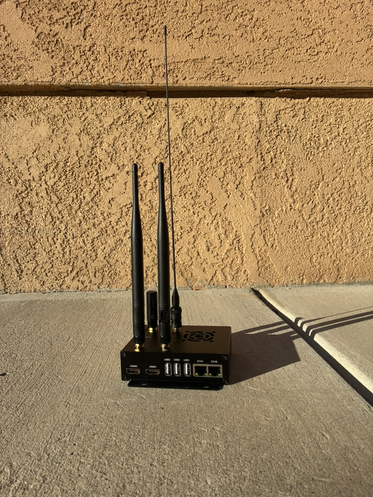
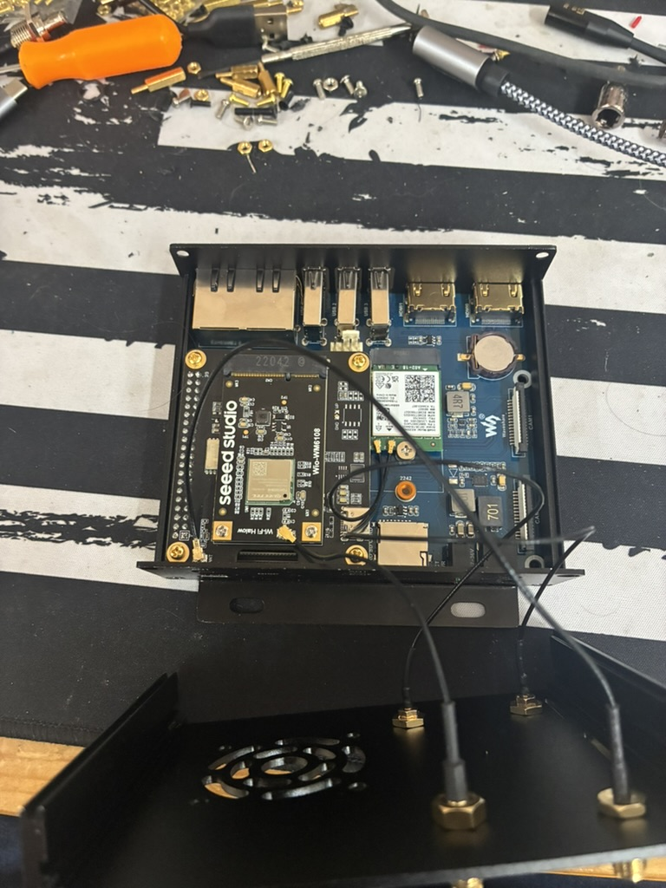

# Raspberry Pi

OpenMANET is designed for Raspberry Pi–based devices running OpenWrt, using Wi‑Fi HaLow boards from Morse Micro (MM6108/MM8108).

{: .note }
For new Raspberry Pi 4 and CM4 builds, an MM8108 radio connected over USB provides higher peak throughput and improved receive sensitivity. The Seeed MM6108 SPI configuration remains an accessible option for the broader range of supported Raspberry Pi models.

---

## Supported Hardware (Firmware-Dependent)

### SBC

| Device | Status | Notes |
|--------|--------|-------|
| Raspberry Pi 4 / CM4 | ✅ Tested | Onboard Wi‑Fi works in AP mode on SPI-based builds |
| Raspberry Pi 3B | ✅ Supported | Requires selecting the correct image for your HaLow interface |
| Raspberry Pi Zero 2 W (Pi2W) | ✅ Supported | Uses the `rpi3` firmware images; requires selecting the correct HaLow interface |
| [MCU Zone CM4-4G_Plus](https://www.aliexpress.us/item/3256808130597667.html) | ✅ Supported | For use with the GW16167 (MM8108). mPCIE to m.2 E-Key adapter needed |

### HaLow

| Device | Interface | MM Chipset | Notes |
|--------|-----------|------------|-------|
| [Gateworks GW16167](https://www.gateworks.com/products/wireless-options/gw16167-mm8108-802-11ah-halow-wifi-m2-card/) | M.2 E-Key (USB 2.0) | MM8108 | Recommended for new Pi 4 / CM4 builds; global radio; up to +26 dBm transmit power |
| [Gateworks GW16170](https://www.gateworks.com/products/wireless-options/gw16170-mm8108-m20-802-11ah-halow-wifi-m2-card/) | M.2 E-Key (USB 2.0) | MM8108-M20 | High-power option for North America; up to +28.5 dBm transmit power |
| Seeed WM1302 + Wio-WM6108 | SPI | MM6108 | Common, readily available Pi HAT setup |
| Silex SX-SDMAH | SDIO | 6108 | |
| Alfa AHPI6108E | SDIO | 6108 | |

### Why Choose MM8108?

The MM8108 increases the maximum PHY rate from 32.5 Mbps to 43.3 Mbps and adds a USB 2.0 host interface. It is also generally 1–3 dB more sensitive than the MM6108 across many channel-width and modulation combinations. Although an MM6108 with OpenMANET's tuned configuration may transmit at slightly higher power than the standard MM8108, the MM8108 can decode weaker signals and retain faster data rates at lower signal levels.

### Reusing a Seeed WM1302 Pi HAT with MM8108

An existing Seeed WM1302 Pi HAT can be reused when upgrading from an MM6108 SPI radio to a Gateworks MM8108 radio. This requires:

- A Gateworks GW16167 or GW16170 radio
- A mini-PCIe-to-M.2 E-Key adapter that passes USB 2.0, such as the [Gateworks GW16151](https://www.gateworks.com/products/mini-pcie-expansion-cards/gw16151-mini-pcie-to-wifi-e-key-m-2-adapter-card/)
- A USB-A-to-USB-C **data cable**
- An appropriate 900 MHz antenna or pigtail for the radio's MMCX connector

Connect the components as follows:

```text
Raspberry Pi USB-A
  └── USB-A-to-USB-C data cable
      └── Seeed WM1302 Pi HAT USB-C
          └── mini-PCIe-to-M.2 E-Key adapter
              └── Gateworks GW16167 or GW16170
```

{: .important }
The USB cable is required. Connect a USB-A port on the Raspberry Pi to the USB-C port on the WM1302 Pi HAT. The Pi's 40-pin header does not carry the MM8108 radio's USB data connection.

Use the `rpi4-mm8108-usb` OpenMANET firmware image for this configuration. The prebuilt MM8108 USB image currently targets Raspberry Pi 4 and CM4 systems.

---

## MM6108 SPI Parts List

| Item | Optional |
|------|----------|
| [Wio WM6108 Wi-Fi HaLow mini PCIe Module](https://www.seeedstudio.com/Wio-WM6108-Wi-Fi-HaLow-mini-PCIe-Module-p-6394.html) | No |
| [WM1302 Pi Hat](https://www.seeedstudio.com/WM1302-Pi-Hat-p-4897.html) | No |
| [External Antenna 868/915 MHz 2 dBi SMA Foldable](https://www.seeedstudio.com/External-Antenna-868-915MHZ-2dBi-SMA-L195mm-Foldable-p-5863.html) | No |
| [UF.L to SMA-K 1.13 mm Cable (120 mm)](https://www.seeedstudio.com/UF-L-SMA-K-1-13-120mm-p-5046.html) | No |
| Raspberry Pi (Pi 4 / CM4 / Pi 3B / Pi2W) | No |
| [21700 Rechargeable Batteries](https://www.amazon.com/dp/B0D3GX96H6?ref_=ppx_hzsearch_conn_dt_b_fed_asin_title_4) | Yes |
| [WaveShare UPS D (21700 version)](https://www.waveshare.com/ups-hat-d.htm) | Yes |
| [Panda PAU06 USB Wi-Fi Adapter](https://www.amazon.com/dp/B00762YNMG?ref_=ppx_hzsearch_conn_dt_b_fed_asin_title_1) | Yes |
| [USB GPS Receiver (u-blox based)](https://www.amazon.com/dp/B01MTU9KTF?ref_=ppx_hzsearch_conn_dt_b_fed_asin_title_1) | Yes |

---

## Board Interface Types: USB, SDIO, and SPI

HaLow modules connect to the Raspberry Pi through different interfaces depending on the board design:

| Interface | Description | Supported on |
|------------|-------------|--------------|
| USB | USB 2.0 host connection used by MM8108 Gateworks radios. | Pi 4 / CM4 with an MM8108 USB image and compatible adapter |
| SDIO | High-speed 4-bit data bus. Offers better throughput and lower latency. | Image-dependent (common on Pi 4 / Pi 3B / CM4) |
| SPI | Serial Peripheral Interface used by some HaLow HATs (for example Seeed boards). Easier to wire but typically slower than SDIO. | Image-dependent (Pi 4 / CM4 / Pi 3B / Pi2W supported on current firmware) |

Notes:  
- Select firmware downloads carefully: the board type, Morse Micro chipset (MM6108 vs MM8108), and interface (`usb`, `spi`, or `sdio`) are part of the firmware filename.
- USB-based MM8108 builds require a complete USB data path between the radio and the Raspberry Pi.
- On SDIO-based HaLow builds, onboard Wi‑Fi usually cannot be used due to SDIO bus conflicts.
- On SPI-based HaLow builds, onboard Wi‑Fi can be used for client access (AP mode).
- In general, `usb` images are for USB-connected MM8108 radios, `spi` images are for SPI-based Seeed HaLow boards, and `sdio` images are for SDIO-based modules (for example Silex or Alfa).

---

## Radio Calibration (BCF Files)

HaLow radios use board configuration files (BCF) to set calibration and regulatory parameters. Some cards or devices, may need to acquire the BCF file from the manufacturer, and be copied to each device.

---

## Optional / Advanced Parts

### Compute Module 4 (CM4) Builds

Most Raspberry Pi Compute Module 4 (CM4) carrier boards work with the OpenMANET image.  
A good option is the [WaveShare CM4 Dual ETH WiFi6 Base](https://www.waveshare.com/cm4-dual-eth-wifi6-base.htm), which includes:

- Two Ethernet ports for bridging or mesh uplink  
- An M.2 slot for a standard Wi-Fi card (AX200 or AX210)  
- Full GPIO header and USB ports for power and debug

CM4 boards are ideal for advanced builds, providing better expandability and efficiency for multi-interface mesh nodes.





#### Other tested CM4 Carrier Boards

**WaveShare CM4-IO-Base-X**
Version A and B have been tested and work as expected
[CM4-IO-BASE-A](https://www.waveshare.com/product/raspberry-pi/boards-kits/compute-module-4-4s-cat/cm4-io-base-a.htm)
[CM4-IO-BASE-B](https://www.waveshare.com/product/raspberry-pi/boards-kits/compute-module-4-4s-cat/cm4-io-base-b.htm)

Notes:
- A M.2 **M Key** slot for communcation cards
- Full GPIO Header
- Same form factor as a Pi4

**MCUZone CM4_WiFi6**
This is a slightly larger carrier board than the WaveShare boards.

Can be found on [AliExpress](https://www.aliexpress.us/item/3256803637327862.html)

Notes:
- A M.2 **A Key** slot for communications cards.  This is limited to the 2230 form factor.
- Full GPIO Header
- Better for height constrained use cases, but a larger length and width form factor.

---

### M.2 Wi-Fi Cards for CM4 Boards

| Module | Band Support | Current Use |
|---------|--------------|-------------|
| [Intel AX200](https://www.waveshare.com/Wireless-AX200.htm) | 2.4 / 5 GHz Wi-Fi 6 | Works as an access point |
| [Intel AX210](https://www.waveshare.com/Wireless-AX210.htm) | 2.4 / 5 / 6 GHz Wi-Fi 6E | Works as an access point |

These cards currently operate as normal Wi-Fi access points.  

### M.2 Wi-Fi Cards that support 802.11s

| Chipset     | Interface  | 802.11s | Notes |
|-------------|------------|-----|----------------------------|
| Intel AX2XX | M.2 AE Key | no  | Can only operate in AP mode|
| QCNA765     | M.2 E Key  | no  | |
| WCN6856     | M.2 E Key  | no  |  |
| QCA6174     | M.2 E Key  | yes | You can only have one wifi network defined when using 802.11s |
| MT7921      | M.2 E Key  | no  | |
| MT7915DAN   | M.2 BM Key | yes | Dual Band AX; 802.11s mesh works, but stability may vary by kernel/driver |
| MT7916AED   | M.2 AE Key | yes | Dual Band AX; 802.11s mesh works, but stability may vary by kernel/driver |


Work is underway to support bonding of HaLow (915 MHz) and 2.4 GHz links together using BATMAN-V for multi-band uplinks.

---

## Development Notes and Future Plans

- Separate firmware builds for SDIO and SPI boards simplify setup.  
- CM4 carrier boards are increasingly recommended for advanced configurations.  
- Future releases will expand multi-gateway mesh support and improve multicast reliability.  

---
