# How to flash OpenMANET onto the HT-HD01 V2

This walkthrough is geared toward a stock flashed HT-HD01 V2.

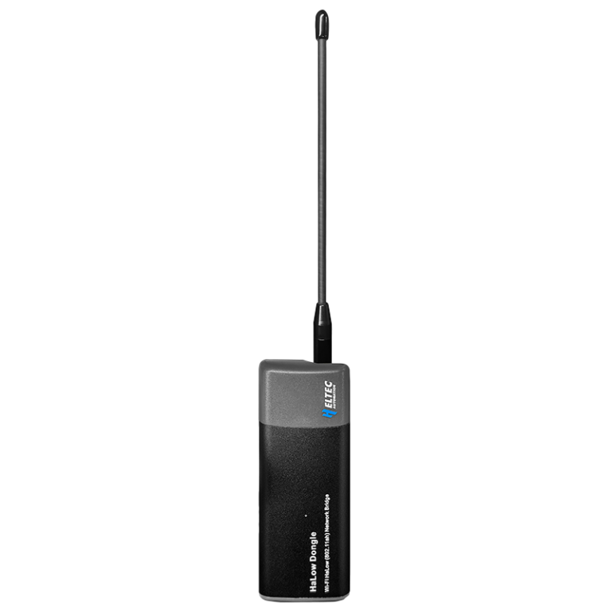

---

### 1. Connect to the HT-HD01 V2's Wi-Fi network

The default password to the network is `heltec.org`

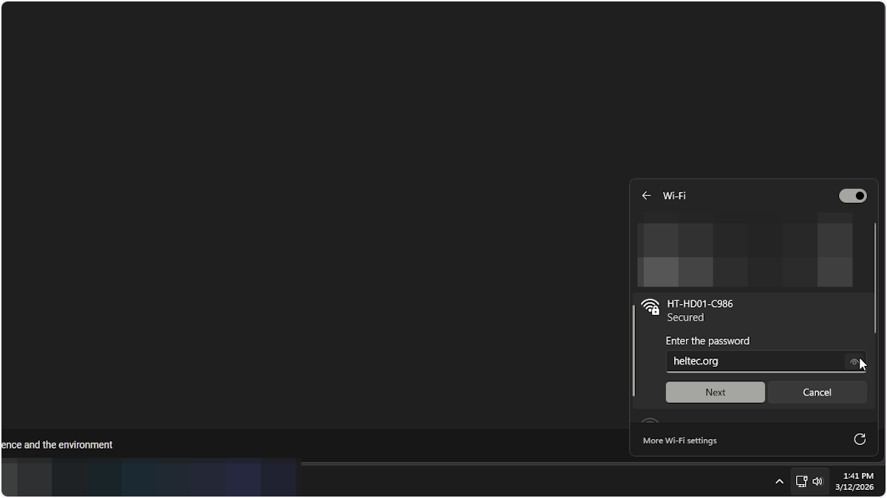

### 2. Once connected click on properties

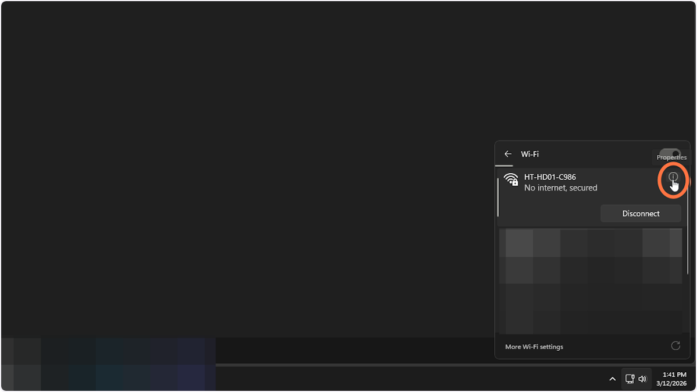

### 3. You will need the default gateway value

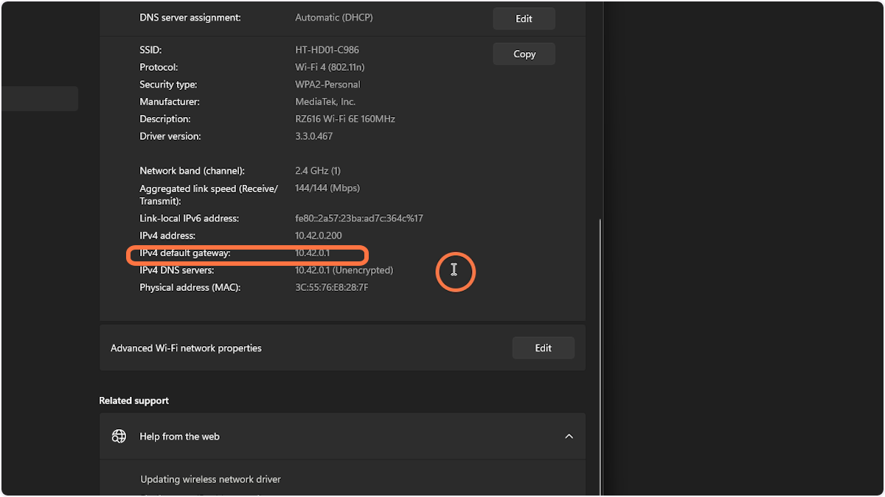

### 4. In your web browser go to the gateway IP address and login

The default password should be `heltec.org`

### 5. Click on the X in the top right

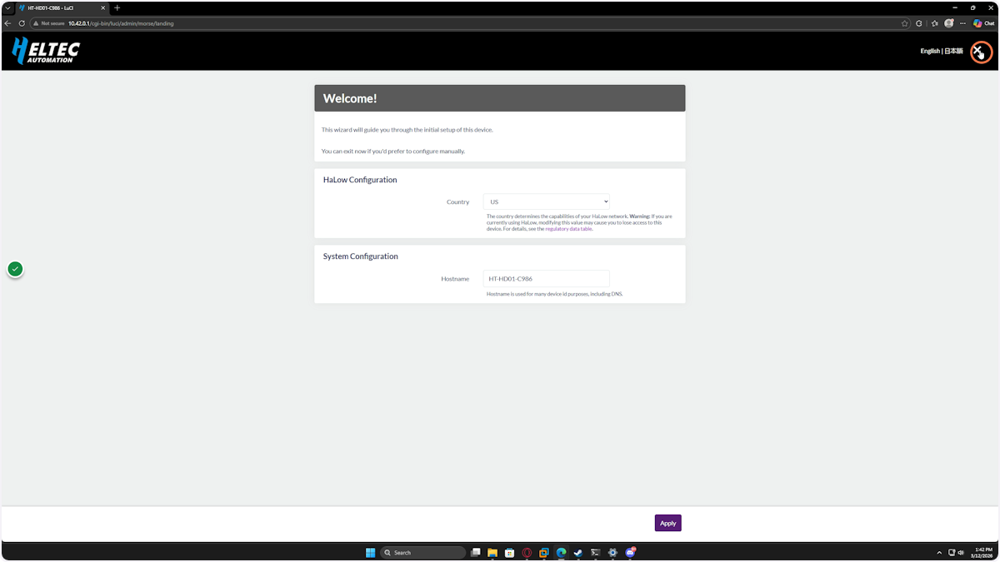

### 6. Navigate to System > Reset / Flash Firmware

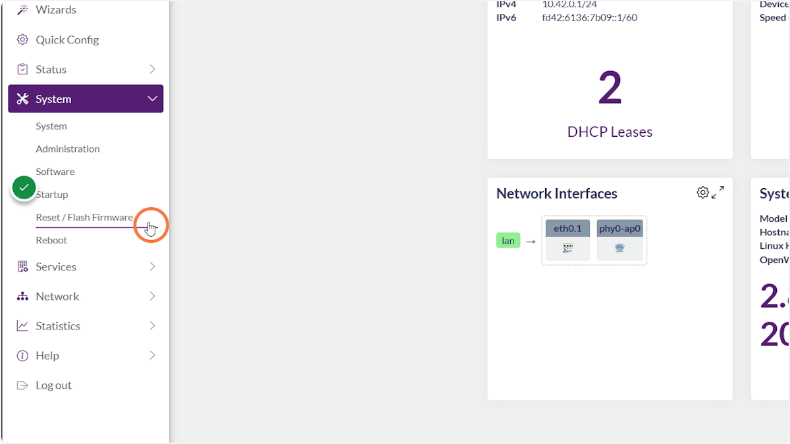

### 7. Click Flash Image

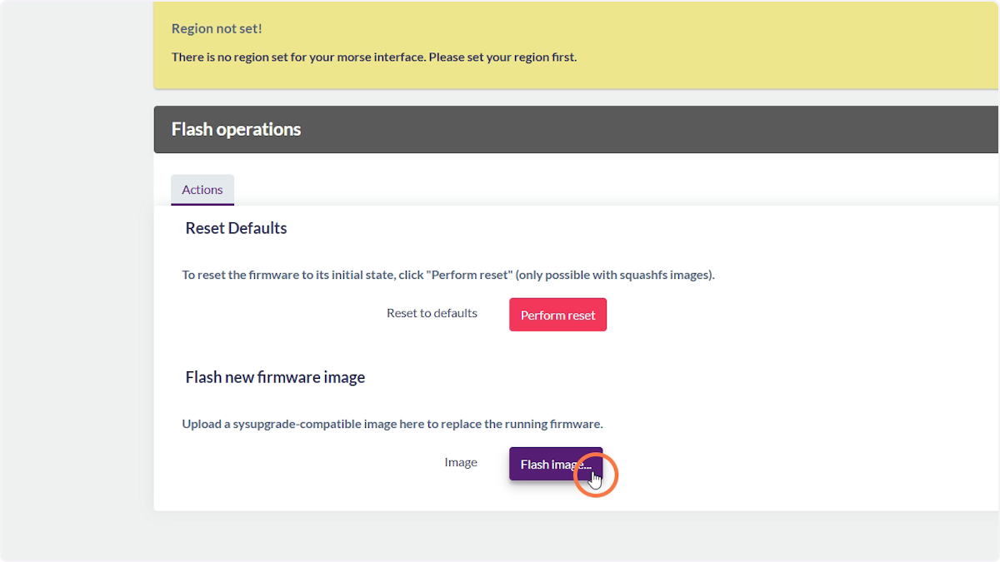

### 8. Click Browse

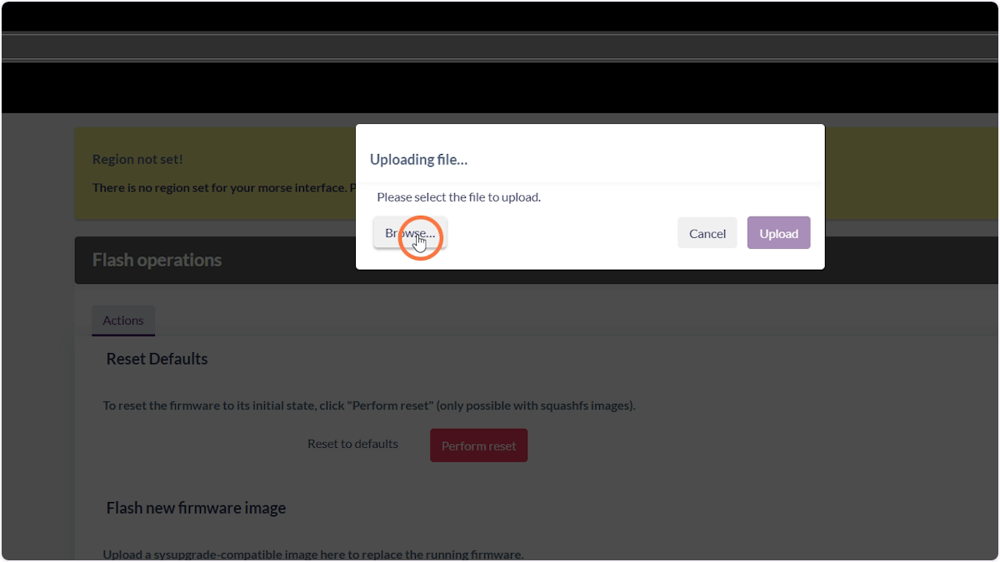

### 9. Select the bin file you want to flash

**IMPORTANT: You need to be flashing the correct bin for this board. Please double check.**
The image you are looking for will have ht-hd01-v2 in the filename. Images can be found here https://github.com/OpenMANET/firmware/releases

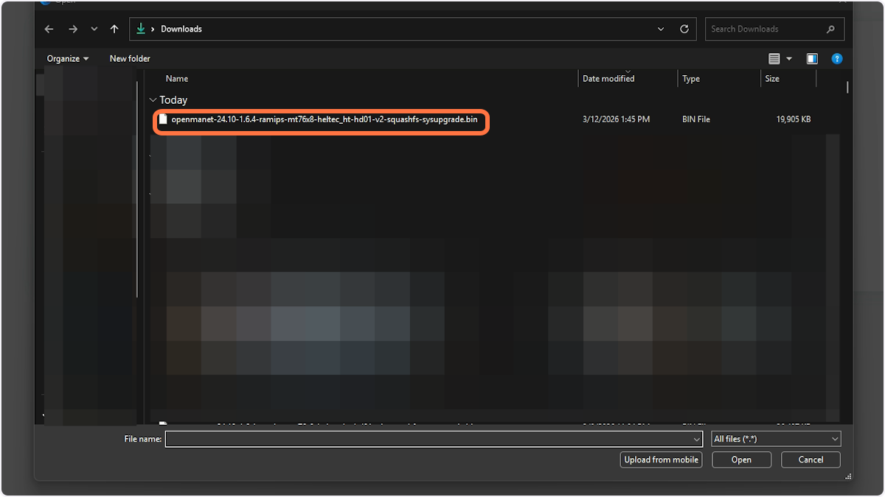

### 10. Click Open once you have confirmed the correct bin has been selected

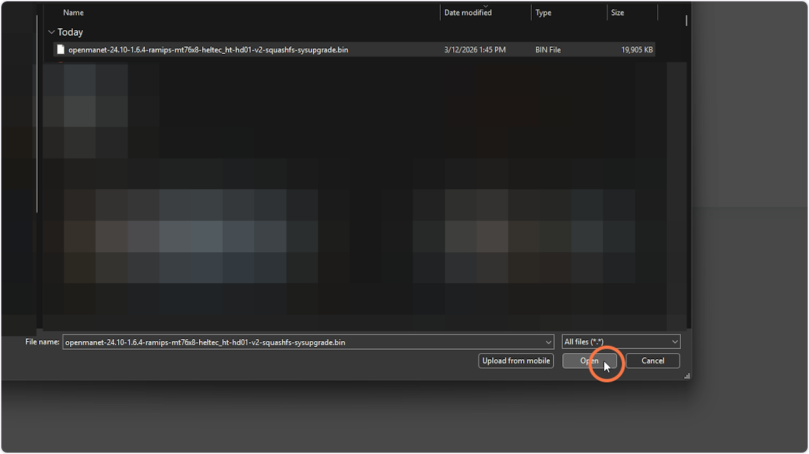

### 11. Click Upload

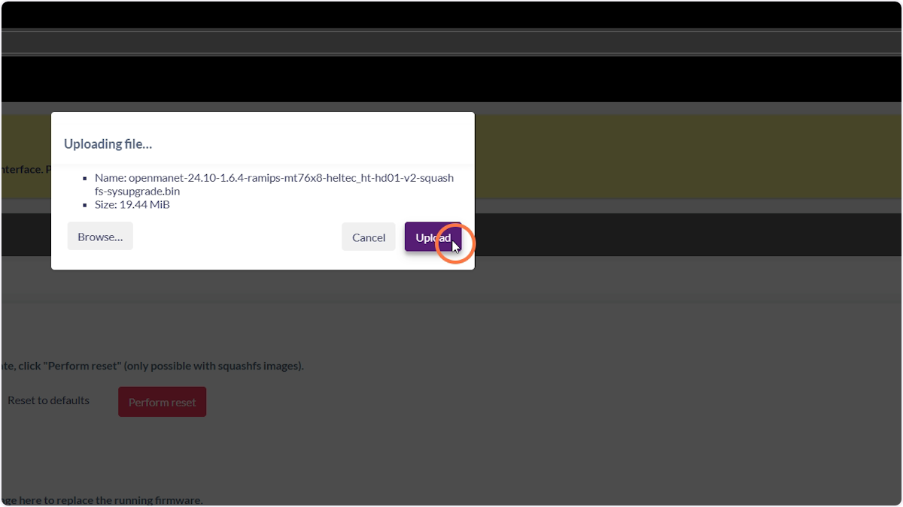

### 12. Wait as the bin uploads

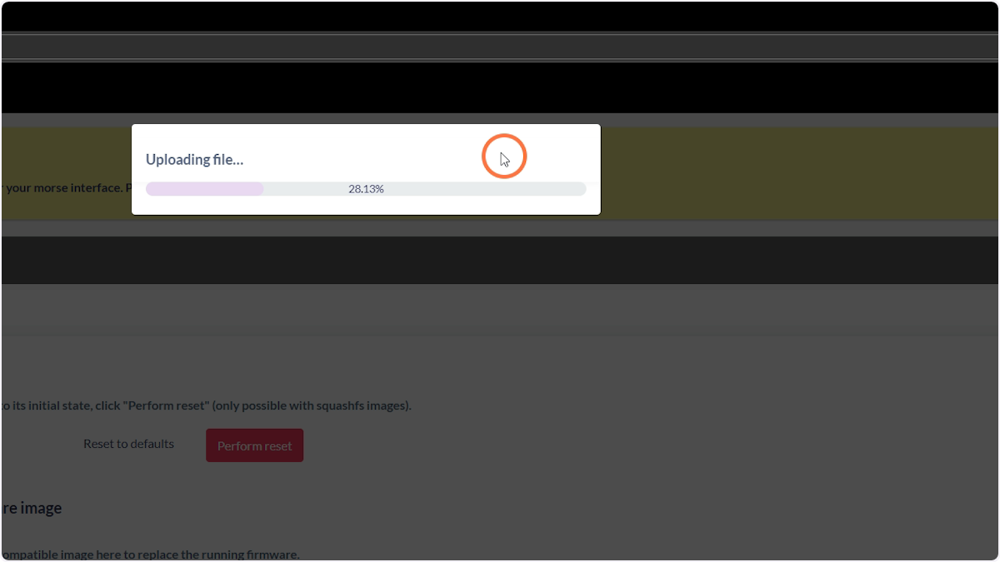

### 13. Uncheck "Keep settings"

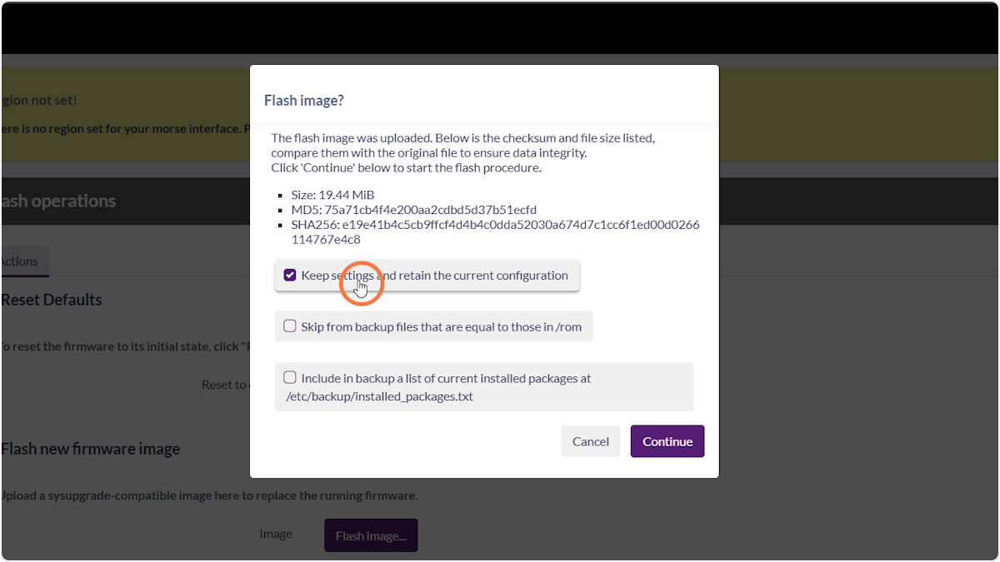

### 14. Click Continue

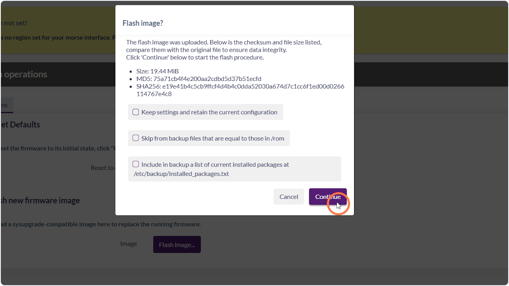

### 15. Wait for the device to flash and reboot

You will need to wait about 10 minutes until the device has been flashed and booted up. You can tell once it's booted when a Wi-Fi network called **openmanet** appears.

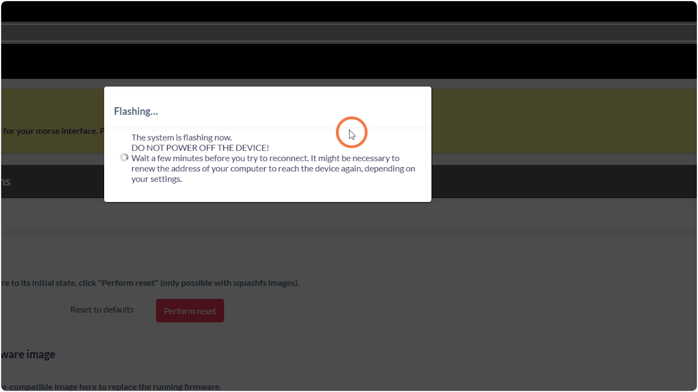

### 16. Connect to the openmanet Wi-Fi network

The password is `openmanet`

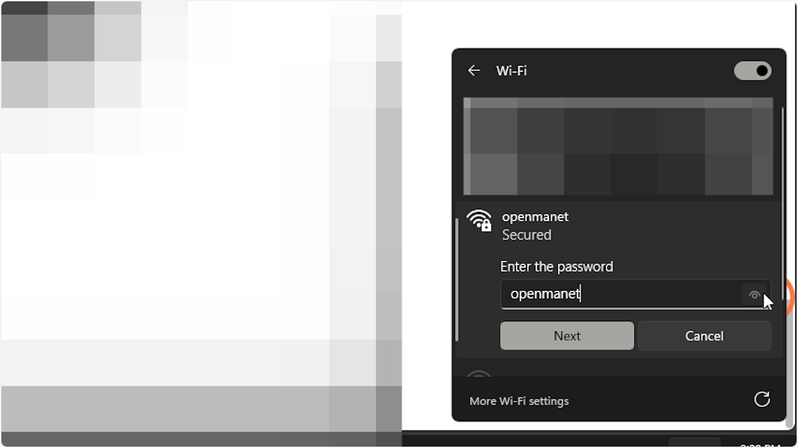

### 17. Log in to the OpenMANET web interface

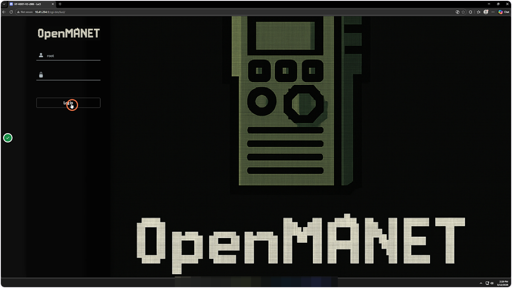

### 18. Go through the wizard to configure your device

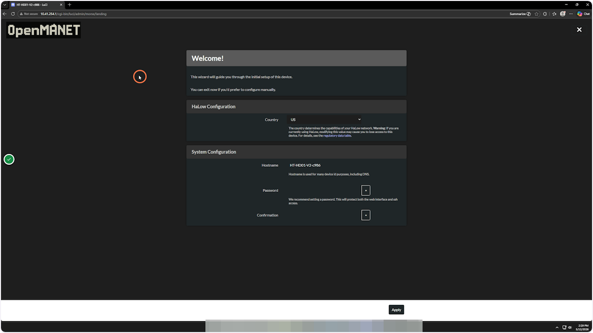
